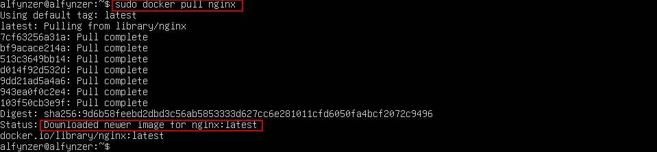
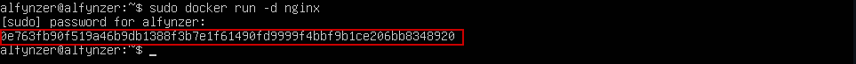
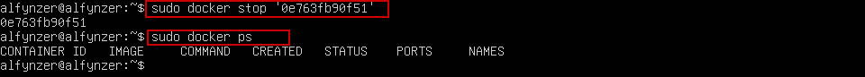
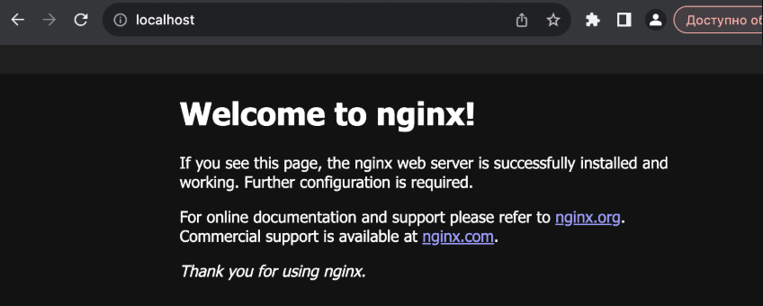

# **Simple Docker**

## **Содержание**

**Part 1. [Готовый докер](#part-1-готовый-докер)**

**Part 2. [Операции с контейнером](#part-2-операции-с-контейнером)**

**Part 3. [Мини веб-сервер](#part-3-мини-веб-сервер)**

**Part 4. [Свой докер](#part-4-свой-докер)**

**Part 5. [Docle](#part-5-dockle)**

**Part 6. [Базовый Docker Compose](#part-6-базовый-docker-compose)**

---

## **Part 1. Готовый докер**

### **1. Взять официальный докер образ с nginx и выкачать его при помощи docker pull**

Устанавливаем с помощью команды `sudo docker pull nginx`



### **2. Проверить наличие докер образа через docker images**

Проверяем командой `sudo docker images`


### **3. Запустить докер образ через docker run -d [image_id|repository]**

`sudo docker run  -d nginx`



### **4. Проверить, что образ запустился через docker ps**

`sudo docker ps`


### **5. Посмотреть информацию о контейнере через docker inspect [container_id|container_name]**

`sudo docker inspect '0e763fb90f51'`


* По выводу команды определить и поместить в отчёт размер контейнера, список замапленных портов и ip контейнера.

Size `sudo docker inspect '0e763fb90f51' | grep Size`


ExposedPorts `sudo docker inspect '0e763fb90f51' | grep -A1 ExposedPorts`


IPAddress `sudo docker inspect '0e763fb90f51' | grep IPAddress`


### **6.Остановить докер образ через docker stop [container_id|container_name] и проверить, что образ остановился через docker ps**

`sudo docker stop '0e763fb90f51'`

`sudo docker ps`



### **7. Запустить докер с портами 80 и 443 в контейнере, замапленными на такие же порты на локальной машине, через команду run**

`sudo docker run -p 80:80 -p 443:443 -d nginx`


### **8. Проверить, что в браузере по адресу localhost:80 доступна стартовая страница nginx**

`sudo curl localhost:80` - позволяет увидеть `html` код страницы


`Отображение в браузере`



### **9. Перезапустить докер контейнер через docker restart [container_id|container_name] и проверить, что контейнер запустился**

`sudo docker restart a22007dc48e0`

`sudo docker ps`

`sudo curl localhost:80`


## **Part 2. Операции с контейнером**
### **1. Прочитать конфигурационный файл nginx.conf внутри докер контейнера через команду exec**

`docker exec <container_id> cat /etc/nginx/nginx.conf`


### **2. Создать на локальной машине файл nginx.conf**

`sudo docker exec trusting_margulis cat /etc/nginx/nginx.conf >Part2/nginx.conf`


### **3. Настроить в нем по пути /status отдачу страницы статуса сервера nginx**


### **4. Скопировать созданный файл nginx.conf внутрь докер образа через команду docker cp**

`sudo docker cp ./nginx.conf trusting_margulis:/etc/nginx/nginx.conf`


Проверяем `sudo docker exec trusting_margulis cat /etc/nginx/nginx.conf`


### **5. Перезапустить nginx внутри докер образа через команду exec**
***Проверка правильности написания файла конфигурации:***

`sudo docker exec trusting_margulis nginx -t `


***Перезапуск nginx:***

`sudo docker exec trusting_margulis nginx -s reload`


### **6. Проверить, что по адресу localhost:80/status отдается страничка со статусом сервера nginx**
 ***Отображение в браузере***

 

***Отображение в терменале*** `curl localhost:80/status`


### **7. Экспортировать контейнер в файл container.tar через команду export**

`sudo docker export trusting_margulis > container.tar`


### **8. Остановить контейнер**

`sudo docker stop trusting_margulis`


***Проверить что контейнер остановлен*** `sudo docker ps -a`


**9. Удалить образ через docker rmi [image_id|repository], не удаляя перед этим контейнеры**

`sudo docker rmi -f nginx`


### **10. Удалить остановленный контейнер**

`sudo docker rm trusting_margulis`


### **11. Импортировать контейнер обратно через команду import**

`sudo docker import container.tar`


### **12. Запустить импортированный контейнер**

`sudo docker run -d -p 80:80 -p 443:443 5ebcdbd4f6f9 nginx -g "daemon off;"`


### **13. Проверить, что по адресу localhost:80/status отдается страничка со статусом сервера nginx**

`curl localhost:80/status`


## **Part 3. Мини веб-сервер**
### **1. Написать мини сервер на C и FastCgi, который будет возвращать простейшую страничку с надписью Hello World!**

***FastCGI (Fast Common Gateway Interface) — это протокол для взаимодействия веб-серверов (Nginx, Apache) с внешними программами, которые генерируют динамический контент. Это улучшенная версия классического CGI, разработанная для повышения производительности.***

`server.c`


### **2. Запустить написанный мини сервер через spawn-fcgi на порту 8080**

* Запускаем докер-контейнер с маппингом на 81 порт

`sudo docker run -d -p 81:81 --name server-01 -it nginx /bin/bash`


* Переносим файл server.c в контейнер

`sudo docker cp server.c server-01:/`


* Перейдем в докер

`sudo docker exec -it server-01 /bin/sh`


*Все дальнейшие шаги будут происходить внутри контейнера.*

* Теперь в докере установим необходимое ПО

```
apt-get update
apt-get upgrade
apt-get install libfcgi-dev
apt-get install spawn-fcgi
apt-get install gcc
```
* Скомпилируем server.c

`gcc server.c -o server -lfcgi`

* Запускаем сервер

`spawn-fcgi -p 8080 ./server`


* Выйти из контенера `exit`
### **3. Написать свой nginx.conf, который будет проксировать все запросы с 81 порта на 127.0.0.1:8080**
* Создадим файл конфигурации ngnix.conf и пропишем его

`touch nginx.conf`


* Перенесем файл в контейнер

`sudo docker cp ./nginx.conf server-01:/etc/nginx/nginx.conf`


***Проверка правильности написания файла конфигурации:***

`sudo docker exec server-01 nginx -t`


***Перезапуск nginx:***

` sudo docker exec server-01 nginx -s reload`


### **4. Проверить, что в браузере по localhost:81 отдается написанная вами страничка**


### *5. Поместите файл nginx.conf в папку ./nginx/nginx.conf (он вам понадобится позже).*

`mkdir -p ./nginx` - создадим директорию

`sudo docker exec server-01 cat /etc/nginx/nginx.conf > ./nginx/nginx.conf`

***Запуск остановленого контенера***
```
sudo fuser -k 8080/tcp   - очищаем порт
sudo docker exec -it server-01 /bin/sh  - переходим внутрь контейнера
spawn-fcgi -p 8080 ./server  - запускаем нашу программу
exit - выход из контейнера
sudo docker exec server-01 nginx -s reload - перезапуск
```

## **Part 4. Ваш собственный докер**

### **1. Напишем свой собственный образ Docker, который:**
* Собирает исходники мини сервера на FastCgi из Части 3

* Запускает его на 8080 порту 

* Копирует внутри образа написанный ./nginx/nginx.conf ;

* Запускает nginx. nginx можно установить внутрь докера самостоятельно, а можно воспользоваться готовым образом с nginx'ом, как базовым.


### **2. Создадим записанный образ Docker с помощью docker build, указав имя и тег.**

`my-docker` - имя `2.0` -тег


### **3. Проверяем docker images, все ли построено правильно.**


### **4. Запустим созданный образ Docker, сопоставив порт 81 с портом 80 на локальной машине и сопоставив папку ./nginx внутри контейнера с адресом, где находятся файлы конфигурации nginx (см. Часть 2 ).**

`sudo docker run -d -p 80:81 -v "$(pwd)/nginx:/etc/nginx" --name my-fcgi-container my-docker:2.0`


### **5. Проверим, что страница написанного мини-сервера доступна на localhost:80.**


### **6. Добавить проксирование страницы /status в ./nginx/nginx.conf для возврата статуса сервера nginx .**

```
location /status {
    stub_status;
    allow all;
}
```
### **7. Перезапускаем образ Docker.**
* Если все сделано правильно, то после сохранения файла и перезапуска контейнера файл конфигурации внутри образа Docker должен обновиться сам без дополнительных действий.


## **8. Убеждаемся, что localhost:80/status теперь возвращает страницу со статусом nginx .


## **Part 5. Dockle**
* После того как вы записали изображение, никогда не будет лишним проверить его на предмет безопасности.

* *Если Dockle не установлен, его надо [установить.](https://github.com/goodwithtech/dockle/releases)*

## **1. Проверьте изображение из предыдущего задания с помощью dockle [image_id|repository].**

`dockle my-docker:2.0`


## **2. Исправим изображение так, чтобы не было ошибок и предупреждений при проверке с помощью dockle .**

**CIS-DI-0005** -  предупреждение убираем с помощью команды `export DOCKER_CONTENT_TRUST=1`,перед тем как собрать докер.

**CIS-DI-0010** - игнорируем предупреждения о GPG-ключах NGINX, так как они являются частью официального процесса установки nginx.

`dockle -ak NGINX_GPGKEY -ak NGINX_GPGKEY_PATH my-docker:2.1`

**CIS-DI-0001** - добавляем создание пользователя без root прав от имени которого будет выполняться запуск

**CIS-DI-0006** -убираем тэг `latest` на версию `1.25.3`

**CIS-DI-0008** -Удаляем опасные SUID/SGID биты с исполняемых файлов


* Проверяем


## **Part 6. Базовый Docker Compose**

### **1. Написать файл docker-compose.yml , используя который:**

* Поднимет Docker-контейнер из Части 5 (он должен работать в локальной сети, т. е. вам не нужно использовать инструкцию EXPOSE и сопоставлять порты с локальной машиной) .

* Поднимет контейнер Docker с nginx , который будет проксировать все запросы с порта 8080 на порт 81 первого контейнера.


### **2. Сопоставить порт 8080 второго контейнера с портом 80 локальной машины.**

`/nginx`


`/nginx2`


### **3. Остановите все работающие контейнеры.**

`docker stop $(docker ps -aq)`

`docker-compose stop` - остановить контейнеры docker-compose

### **4. Соберем и запустим проект с помощью команд docker-compose buildи docker-compose up.**


### **5. Убедимся, что браузер возвращает страницу, которую вы написали на localhost:80 , как и раньше.

